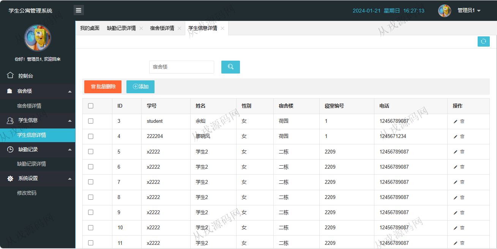

<h1 align="center">200.学生公寓管理系统</h1>

 获取sql文件 QQ: 386869957 QQ群: 377586148 

 [更多源码项目: 从戎源码网](https://armycodes.com/) 

## 简介

> 本代码来源于网络,仅供学习参考使用!
>
> 提供1.远程部署/2.修改代码/3.设计文档指导/4.框架代码讲解等服务
> 
> 访问地址：http://localhost:8080/login
> 
> 管理员：admin 123456
> 
> 学生：student 123456
> 

## 项目介绍
基于ssm的学生公寓管理系统：前端 jsp、jquery，后端 springmvc、spring、mybatis；角色分为管理员、学生；集成宿舍楼、学生信息、缺勤记录等功能于一体的系统。

## 功能介绍

- 基本功能：登录，退出，个人信息查看
- 宿舍楼：宿舍楼信息的增删改查，按名称模糊搜索，批量删除
- 学生信息：学生信息的增删改查，模糊搜索，批量删除
- 缺勤记录：缺勤记录的增删改查，按标题模糊搜索，批量删除
- 系统设置：密码修改

## 环境

- <b>IntelliJ IDEA 2021.3</b>

- <b>Mysql 5.7.26</b>

- <b>Tomcat 9.0.37</b>

- <b>JDK 1.8</b>

## 运行截图

